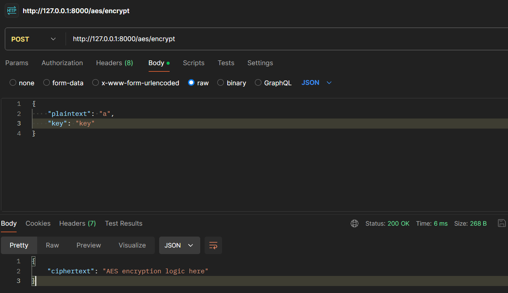
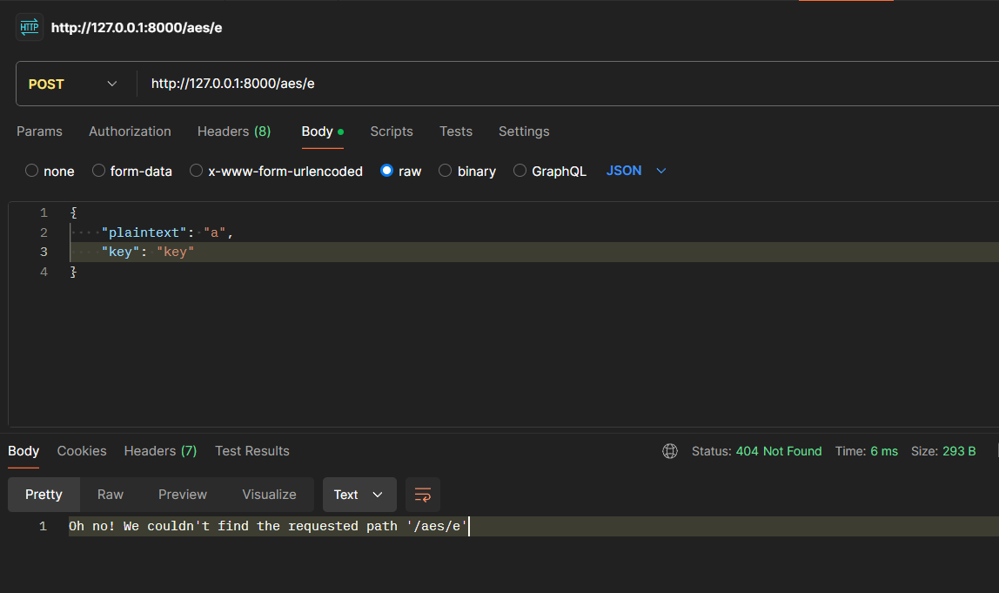

# Controllers

In this part we will write endpoints for 3 cryptographic algorithms:

`/aes/encrypt`\
`/aes/decrypt`\
`/rsa/encrypt`\
`/rsa/decrypt`\
`/sha256/hash`

To do so, create in the `src` directory a folder named `controllers`.

Now create 3 files:

`aes_controller.rs`\
`rsa_controller.rs`\
`sha_controller.rs`


And also `mod.rs`

In Rust `mod.rs` files are used as module files to define the contents of a directory as a module. These files typically contain declarations of sub-modules, re-exports, or other module-level items.

Put this code in `mod.rs` to make controllers visible:
```rs
pub mod aes_controller;
pub mod rsa_controller;
pub mod sha_controller;
pub mod error_controller;
```
\
To use them add this line to `main.rs`:
```rs
mod controllers;
```

A module is a collection of items: functions, structs, traits, impl blocks, and even other modules.

#### Controllers implementation

In our `POST` methods, we are receiving JSON format, so we need to deserialize it to the request struct. Then to create a response we need to serialize it to the JSON format.

Add necessary dependencies: 
```toml
rocket = { version = "0.5.0", features = ["json"] }
serde = { version = "1.0", features = ["derive"] }
```

Now we can use deserialized request struct as an argument to the function.
And also serialized response struct as a return parameter.

Copy contents into `aes_controller.rs` file:
```rs
use rocket::response::status::Custom;
use rocket::serde::{Deserialize, Serialize, json::Json};

#[derive(Deserialize)]
struct AesEncryptRequest {
    plaintext: String,
    key: String,
}

#[derive(Serialize)]
struct AesEncryptResponse {
    ciphertext: String,
}

#[post("/aes/encrypt", format = "json", data = "<request>")]
pub fn encrypt(request: Json<AesEncryptRequest>) -> Result<Json<AesEncryptResponse>, Custom<String>> {
    Ok(Json(AesEncryptResponse {
        ciphertext: "AES encryption logic here".to_string(),
    }))
}

#[derive(Deserialize)]
struct AesDecryptRequest {
    ciphertext: String,
    key: String,
}

#[derive(Serialize)]
struct AesDecryptResponse {
    plaintext: String,
}

#[post("/aes/decrypt", format = "json", data = "<request>")]
pub fn decrypt(request: Json<AesDecryptRequest>) -> Result<Json<AesDecryptResponse>, Custom<String>> {
    Ok(Json(AesDecryptResponse {
        plaintext: "AES decryption logic here".to_string(),
    }))
}
```
\
Copy contents into `rsa_controller.rs` file:
```rs
use rocket::post;
use rocket::response::status::Custom;
use rocket::serde::{Serialize, Deserialize, json::Json};

#[derive(Deserialize)]
struct RsaEncryptRequest {
    plaintext: String,
    public_key: String,
}

#[derive(Serialize)]
struct RsaEncryptResponse {
    ciphertext: String,
}

#[post("/rsa/encrypt", format = "json", data = "<request>")]
pub fn encrypt(request: Json<RsaEncryptRequest>) -> Result<Json<RsaEncryptResponse>, Custom<String>> {
    Ok(Json(RsaEncryptResponse {
        ciphertext: "RSA encryption logic here".to_string(),
    }))
}

#[derive(Deserialize)]
struct RsaDecryptRequest {
    ciphertext: String,
    public_key: String,
}

#[derive(serde::Serialize)]
struct RsaDecryptResponse {
    plaintext: String,
}

#[post("/rsa/decrypt", format = "json", data = "<request>")]
pub fn decrypt(request: Json<RsaDecryptRequest>) -> Result<Json<RsaDecryptResponse>, Custom<String>> {
    Ok(Json(RsaDecryptResponse {
        plaintext: "RSA decryption logic here".to_string(),
    }))
}
```
\
Copy contents into `sha_controller.rs` file:
```rs
use rocket::response::status::Custom;
use rocket::serde::{Serialize, Deserialize, json::Json};

#[derive(Deserialize)]
struct ShaInput {
    input: String,
}

#[derive(Serialize)]
struct ShaOutput {
    hash: String,
}

#[post("/sha256/hash", format = "json", data = "<input>")]
pub fn hash(input: Json<ShaInput>) -> Result<Json<ShaOutput>, Custom<String>> {
    Ok(Json(ShaOutput {
        hash: "hash".to_string(),
    }))
}
```
\
Let's add also some custom error handlers:

Copy contents into `error_controller.rs` file:
```rs
use rocket::Request;

#[catch(404)]
pub fn not_found(req: &Request) -> String {
    format!("Oh no! We couldn't find the requested path '{}'", req.uri())
}

#[catch(422)]
pub fn bad_input() -> String {
    "Oh no! Content you provided is unprocessable".to_string()
}
```

We will implement the logic in next steps.

\
Mount the controllers in the `main.rs` and register the error catchers. New `rocket` function should look like:
```rs
fn rocket() -> _ {
    rocket::build()
    .register("/", catchers![
        controllers::error_controller::not_found,
        controllers::error_controller::bad_input
    ])
    .mount("/", routes![index])
    .mount("/", routes![
        controllers::aes_controller::encrypt,
        controllers::aes_controller::decrypt,
        controllers::rsa_controller::encrypt,
        controllers::rsa_controller::decrypt,
        controllers::sha_controller::hash,
    ])
}
```

#### Test endpoints
Screenshots from Postman:


