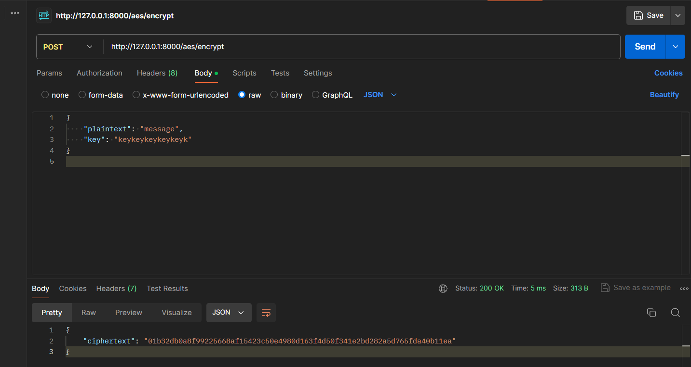
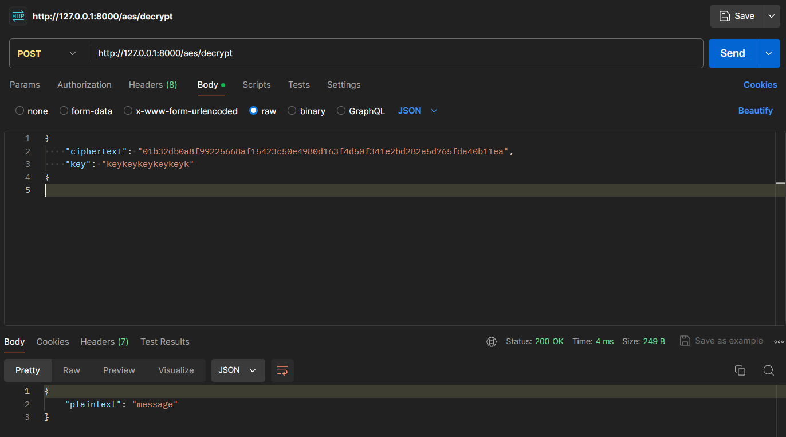
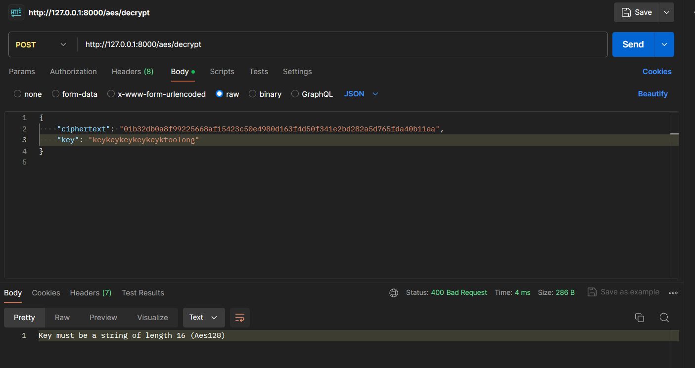

# AES
### In this part we will implement the logic of AES128 algorithm.

To encrypt data we need to pass key and plaintext.
Length of secret key should be 16 for 128 bits key size, so in request we will pass string of 16 characters.

To decode we need to pass key and ciphertext (encrypted text). The key should be the same as when encoding, because AES is a symmetric-key algorithm.

Encoded message will be in `hex` format.

In GCM (Galois/Counter Mode) for AES, the encrypted data can change for every request even if the plaintext and key remain the same. This is because GCM mode uses a unique nonce (or IV) for each encryption operation, which ensures that the resulting ciphertext is different each time.

## Let's code

Add dependencies to
`Cargo.toml`

```
aes-gcm = "0.10.3"
hex = "0.4.3"
```

Add imports to `aes_controller.rs`
```rs
use rocket::http::Status;

use crate::models::{AesPlaintext, AesKey, AesCiphertext};
use crate::services::aes_service::AesService;
```

And update funcions bodies

```rs
#[post("/aes/encrypt", format = "json", data = "<request>")]
pub fn encrypt(request: Json<AesEncryptRequest>) -> Result<Json<AesEncryptResponse>, Custom<String>> {
    if request.key.len() != 16 {
        return Err(Custom(Status::BadRequest, "Key must be a string of length 16 (Aes128)".to_string()));
    }

    let plaintext = AesPlaintext { data: request.plaintext.clone() };
    let key = AesKey { key_bytes: &request.key.as_bytes() };
    let ciphertext = AesService::encrypt(plaintext, key);

    Ok(Json(AesEncryptResponse {
        ciphertext: ciphertext.encoded_data,
    }))
}
```
```rs
pub fn decrypt(request: Json<AesDecryptRequest>) -> Result<Json<AesDecryptResponse>, Custom<String>> {
    if request.key.len() != 16 {
        return Err(Custom(Status::BadRequest, "Key must be a string of length 16 (Aes128)".to_string()));
    }

    let ciphertext = AesCiphertext { encoded_data: request.ciphertext.clone() };
    let key = AesKey { key_bytes: request.key.as_bytes() };

    let plaintext = AesService::decrypt(ciphertext, key);

    Ok(Json(AesDecryptResponse {
        plaintext: plaintext.data,
    }))
}
```

#### New `aes.rs` file with models in `/src/models` directory

```rs
pub struct AesKey<'a> {
    pub key_bytes: &'a [u8], // AES128 key is 128 bits (16 bytes)
}

pub struct AesPlaintext {
    pub data: String, // Plaintext data to be encrypted
}

pub struct AesCiphertext {
    pub encoded_data: String, // Encrypted ciphertext data
}
```

To see models outside, create another file in `/src/models` directory. Name it `mod.rs`. We will also add `rsa` and `sha` modules at once.

```rs
pub mod aes;
pub mod rsa;
pub mod sha;

pub use aes::{AesKey, AesPlaintext, AesCiphertext};
```

#### New `aes_service.rs` file with the aes logic in `/src/services` directory

```rs
use aes_gcm::{
    aead::{Aead, AeadCore, KeyInit, OsRng},
    Aes128Gcm, Key, Nonce
};

use crate::models::{AesKey, AesPlaintext, AesCiphertext};

pub struct AesService;

impl AesService {
    pub fn encrypt(plaintext: AesPlaintext, key: AesKey) -> AesCiphertext {
        let plaintext_bytes = plaintext.data.as_bytes();
        let key = Key::<Aes128Gcm>::from_slice(key.key_bytes);
        let nonce = Aes128Gcm::generate_nonce(&mut OsRng);

        let cipher = Aes128Gcm::new(key);

        let ciphered_data = cipher.encrypt(&nonce, plaintext_bytes)
            .expect("failed to encrypt");
        
        // combining nonce and encrypted data together
        // for storage purpose
        let mut encrypted_data: Vec<u8> = nonce.to_vec();
        encrypted_data.extend_from_slice(&ciphered_data);
        
        let hex_data: String = hex::encode(encrypted_data);
        AesCiphertext { encoded_data: hex_data }
    }

    pub fn decrypt(ciphertext: AesCiphertext, key: AesKey) -> AesPlaintext {
        let encrypted_data = hex::decode(ciphertext.encoded_data)
            .expect("failed to decode hex string into vec");
        let key = Key::<Aes128Gcm>::from_slice(key.key_bytes);

        let (nonce_arr, ciphered_data) = encrypted_data.split_at(12);
        let nonce = Nonce::from_slice(nonce_arr);

        let cipher = Aes128Gcm::new(key);

        let plaintext_decrypted = cipher.decrypt(nonce, ciphered_data)
            .expect("failed to decrypt data");

        let plaintext = String::from_utf8(plaintext_decrypted)
            .expect("failed to convert vector of bytes to string");

        AesPlaintext { data: plaintext }
    }
}
```

To see services outside, create another file in `/src/services` directory. Name it `mod.rs`

```rs
pub mod aes_service;
pub mod rsa_service;
pub mod sha_service;
```

At the end update `main.rs` file with our new modules. Put them below `mod controllers` line
```rs
mod controllers; // this line exist
mod models;
mod services;
```

## Let's test
Enter message you want to encrypt in `plaintext` and 16-characters `key`.

Your json for encryption should look like
```json
{
    "plaintext": "message",
    "key": "keykeykeykeykeyk"
}
```

Your json for decryption should look like
```json
{
    "ciphertext": "01b32db0a8f99225668af15423c50e4980d163f4d50f341e2bd282a5d765fda40b11ea",
    "key": "keykeykeykeykeyk"
}
```

Remember to use the same key for encryption and decryption.

Try out other combination of messages or keys and check if the original message is the same!

Screenshots from Postman:
`http://127.0.0.1:8000/aes/encrypt`

`http://127.0.0.1:8000/aes/decrypt`


The case when we pass key longer or shorter than 16 charactes

