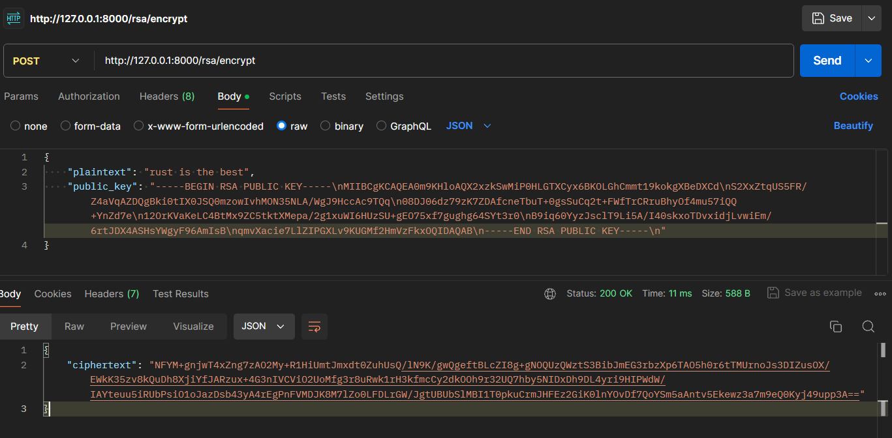

# RSA
### In this part we will implement the logic of RSA algorithm with 2048 bit Key Size.

RSA (Rivest-Shamir-Adleman) is a widely used public-key cryptographic algorithm. It enables secure data transmission by using two keys: a public key, which can be shared openly, and a private key, which is kept secret.\
Public key is used to encrypt data.\
Private key is used to decrypt data.

RSA's security relies on the practical difficulty of factorizing the product of two large prime numbers, making it a cornerstone of secure communications in various applications, including SSL/TLS for secure web browsing, email encryption, and more.

### Let's code
Start with updating `rsa_controller.rs`.\
We can see that there are not 2 but 3 endpoints, because we also need to generate public and private key.
```rs
use rocket::response::status::Custom;
use rocket::serde::{Deserialize, Serialize, json::Json};
use crate::models::{RsaPlaintext, RsaCiphertext, RsaKey};
use crate::services::rsa_service::RsaService;

#[derive(Serialize)]
struct RsaKeyResponse {
    public_key: String,
    private_key: String,
}

#[post("/rsa/generate_keys")]
pub fn generate_keys() -> Json<RsaKeyResponse> {
    let rsa_key: RsaKey = RsaService::generate_keys();

    Json(RsaKeyResponse {
        public_key: rsa_key.public_key,
        private_key: rsa_key.private_key,
    })
}

#[derive(Deserialize)]
struct RsaEncryptRequest {
    plaintext: String,
    public_key: String,
}

#[derive(Serialize)]
struct RsaEncryptResponse {
    ciphertext: String,
}

#[post("/rsa/encrypt", format = "json", data = "<request>")]
pub fn encrypt(request: Json<RsaEncryptRequest>) -> Result<Json<RsaEncryptResponse>, Custom<String>> {
    let plaintext_bytes = request.plaintext.as_bytes().to_vec();
    let plaintext = RsaPlaintext { data: plaintext_bytes };

    let ciphertext = RsaService::encrypt(plaintext, &request.public_key);
    let ciphertext_str = base64::encode(ciphertext.data);

    Ok(Json(RsaEncryptResponse {
        ciphertext: ciphertext_str,
    }))
}

#[derive(Deserialize)]
struct RsaDecryptRequest {
    ciphertext: String,
    private_key: String,
}

#[derive(Serialize)]
struct RsaDecryptResponse {
    plaintext: String,
}

#[post("/rsa/decrypt", format = "json", data = "<request>")]
pub fn decrypt(request: Json<RsaDecryptRequest>) -> Result<Json<RsaDecryptResponse>, Custom<String>> {
    let ciphertext_bytes = base64::decode(&request.ciphertext).unwrap();
    let ciphertext = RsaCiphertext { data: ciphertext_bytes };

    let plaintext = RsaService::decrypt(ciphertext, &request.private_key);
    let plaintext_str = String::from_utf8(plaintext.data).expect("Ciphertext is not valid UTF-8");

    Ok(Json(RsaDecryptResponse {
        plaintext: plaintext_str,
    }))
}
```

Add new endpoint to `main.rs` file
```rs
// controllers::aes_controller::decrypt,
controllers::rsa_controller::generate_keys, // add only this line
// controllers::rsa_controller::encrypt,
```

Append new dependencies to `Cargo.toml` file
```rs
rsa = "0.9.6"
rand = "0.8"
pkcs1 = "0.7.5"
base64 = "0.22.1"
```

#### Now it is time to implement the model and logic

Copy the code into `src/models/rsa.rs` file
```rs
pub struct RsaKey {
    pub public_key: String,
    pub private_key: String,
}

pub struct RsaPlaintext {
    pub data: Vec<u8>,
}

pub struct RsaCiphertext {
    pub data: Vec<u8>,
}
```
To make them visible outside add this line to the file `src/models/mod.rs`
```rs
pub use rsa::{RsaKey, RsaPlaintext, RsaCiphertext};
```

##### Logic of the algorithm
In the `src/services/rsa_service.rs` put the code below

```rs
use rsa::{Pkcs1v15Encrypt, RsaPrivateKey, RsaPublicKey,
    pkcs1::EncodeRsaPrivateKey, pkcs1::EncodeRsaPublicKey, pkcs1::LineEnding,
    pkcs1::DecodeRsaPrivateKey, pkcs1::DecodeRsaPublicKey,
};
use crate::models::{RsaPlaintext, RsaCiphertext, RsaKey};

pub struct RsaService;

impl RsaService {
    pub fn generate_keys() -> RsaKey {
        let mut rng = rand::thread_rng();
        let bits = 2048;
        let priv_key = RsaPrivateKey::new(&mut rng, bits).expect("failed to generate a key");
        let pub_key = RsaPublicKey::from(&priv_key);

        let priv_key_pem: String = priv_key.to_pkcs1_pem(pkcs1::LineEnding::LF).expect("failed to encode private key").to_string();
        let pub_key_pem: String = pub_key.to_pkcs1_pem(pkcs1::LineEnding::LF).expect("failed to encode public key").to_string();

        RsaKey {
            public_key: pub_key_pem,
            private_key: priv_key_pem,
        }
    }

    pub fn encrypt(plaintext: RsaPlaintext, public_key_pem: &str) -> RsaCiphertext {
        let pub_key = RsaPublicKey::from_pkcs1_pem(&public_key_pem).expect("failed to parse public key");

        let mut rng = rand::thread_rng();
        let enc_data = pub_key.encrypt(&mut rng, Pkcs1v15Encrypt, &plaintext.data).expect("failed to encrypt");
        RsaCiphertext { data: enc_data }
    }

    pub fn decrypt(ciphertext: RsaCiphertext, private_key_pem: &str) -> RsaPlaintext {
        let priv_key = RsaPrivateKey::from_pkcs1_pem(&private_key_pem).expect("failed to parse private key");

        let dec_data = priv_key.decrypt(Pkcs1v15Encrypt, &ciphertext.data).expect("failed to decrypt");
        RsaPlaintext { data: dec_data }
    }
}
```

### How things work
At first we generate private and public key. Here, to create private key we pass random crypto core and key size in bytes. Then based on private key, public one is generated.\
In the next step we can encrypt our message by passing it and the public key into `JSON`. Generated ciphertext is in `base64` format.\
Then, to decode the message, pass it with the private key into `JSON`.

### Testing
First generate keys (this can take few seconds):
`http://127.0.0.1:8000/rsa/generate_keys`


Make your message up. Copy public key into JSON.

`http://127.0.0.1:8000/rsa/encrypt`


Copy ciphertext from encoding. Put private key into JSON.
`http://127.0.0.1:8000/rsa/decrypt`


***Voilà!***\
We received the same message as we encrypted.
