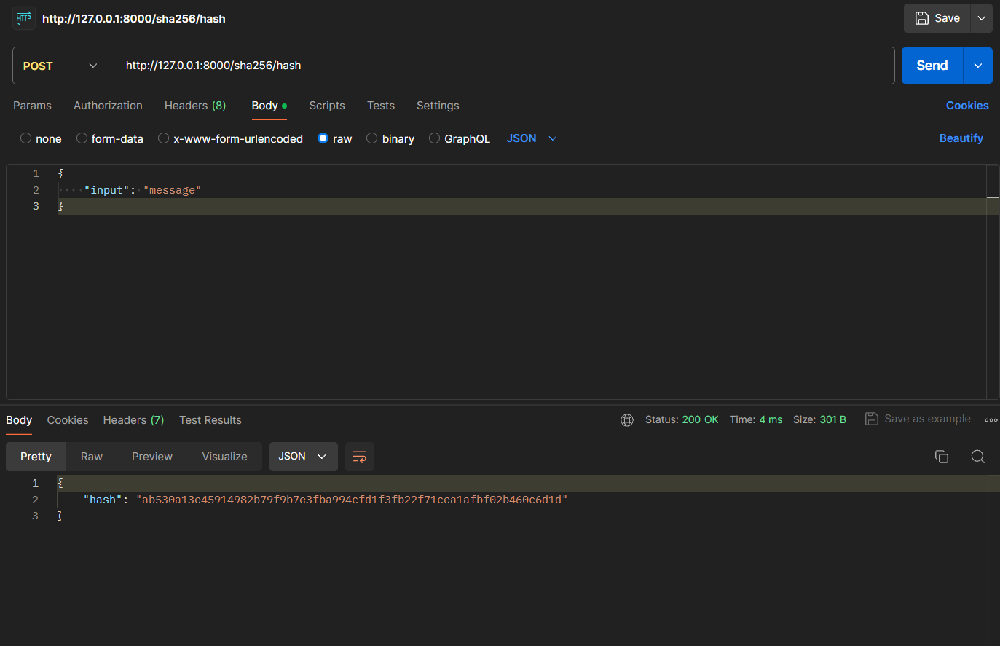

# SHA-256
### In this part we will implement the logic of SHA-256 algorithm.

SHA-256 is a cryptographic hash function that generates a fixed-size 256-bit (32-byte) hash for an input. Unlike encryption, hashing is a one-way process, meaning you can't reverse the hash to get the original input. The hashed value is always the same for the given input.

### Let's code
Start with updating `sha_controller.rs`.
```rs
use rocket::serde::{json::Json};
use crate::services::sha_service::ShaService;
use crate::models::{ShaRequest, ShaResponse};

#[post("/sha256/hash", format = "json", data = "<request>")]
pub async fn hash(request: Json<ShaRequest>) -> Json<ShaResponse> {
    let response = ShaService::hash(request.into_inner());
    Json(response)
}
```

Append new dependency to `Cargo.toml` file
```rs
sha2 = "0.10.8"
```

#### Now it is time to implement the model and logic

Because SHA has simple structure, it does not need models, but for experiment let's move here reqest and response.

Copy the code into `src/models/sha.rs` file
```rs
use serde::{Serialize, Deserialize};

#[derive(Deserialize)]
pub struct ShaRequest {
    pub input: String,
}

#[derive(Serialize)]
pub struct ShaResponse {
    pub hash: String,
}
```
To make them visible outside add this line to the file `src/models/mod.rs`
```rs
pub use sha::{ShaRequest, ShaResponse};
```

##### Logic of the algorithm
In the `src/services/sha_service.rs` put the code below

```rs
use sha2::{Sha256, Digest};
use crate::models::{ShaRequest, ShaResponse};

pub struct ShaService;

impl ShaService {
    pub fn hash(input: ShaRequest) -> ShaResponse {
        let mut hasher = Sha256::new();
        hasher.update(input.input.as_bytes());
        let result = hasher.finalize();
        ShaResponse {
            hash: format!("{:x}", result),
        }
    }
}
```

### How things work
We are passing some character string to request.\
Then it is hashed and returned as a result in `hex` format.

### Testing
Generate hash for the input message.\
Your JSON can look like this
```json
{
    "input": "message"
}
```
`http://127.0.0.1:8000/sha256/hash`


**Ready**\
We see the hashed value in response
