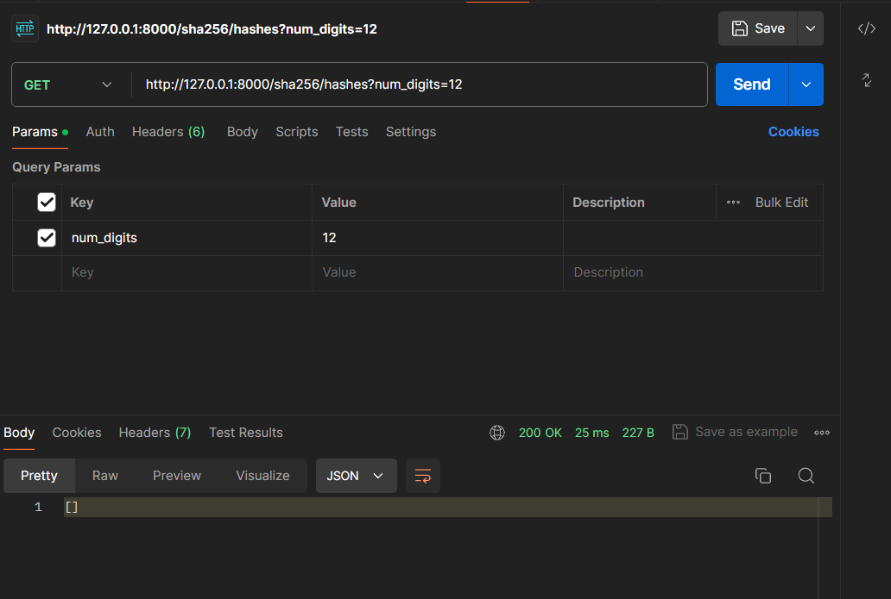
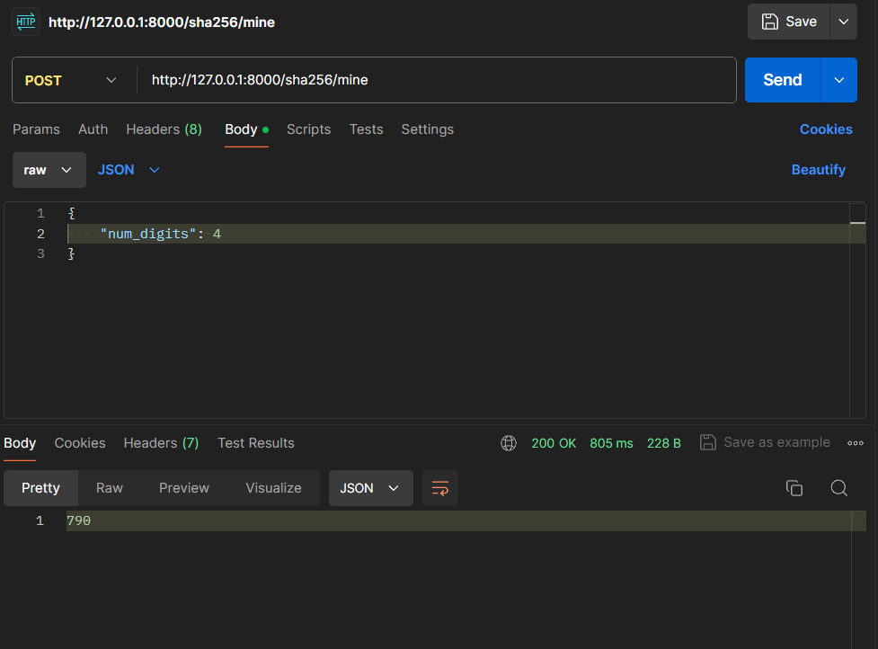
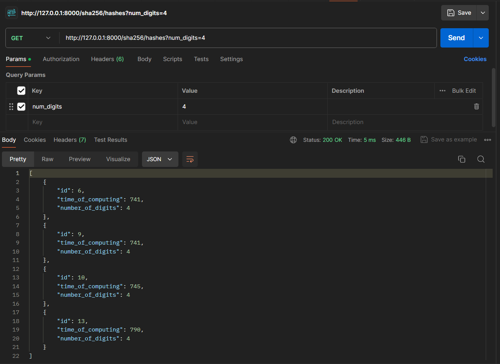
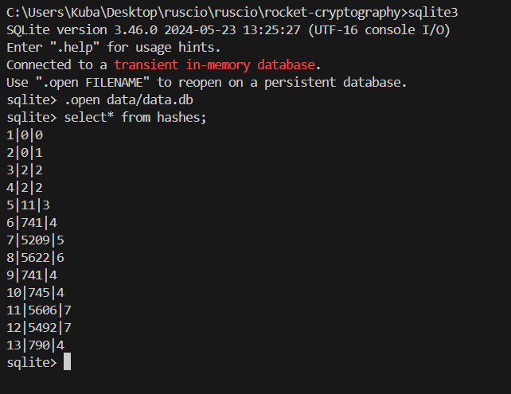

# Database
For the purpose of this tutorial we will choose simple database system called `SQLite`.

### What is SQLite?
SQLite is a relational database management system with a lightweight feel in terms of setup complexity and resource usage. It is serverless and requires zero configurations. Because SQLite is literally a database residing in a single cross-platform file, it requires no administration.

#### Installation
SQLite is pre-installed on new Mac computers, but (if needed) the Mac command is as follows:\
`brew install sqlite`

Here’s the installation command for Linux users:\
`sudo apt install sqlite3`

For Windows open terminal as administrator and run command\
`winget install sqlite.sqlite`

Now, exit the command prompt and open a new one as administrator.\
Confirm installation, like so:\
`sqlite3 --version`

At the time of tutorial `3.45.3` version is available.

#### Diesel
`Diesel` is an ORM and query builder designed to reduce the boilerplate for database interactions Can be used to create and handle connections to the SQLite database.

In the root directory create `data/data.db` file.

Here, we also add the `dotenvy` library to manage environment variables. This library looks for a file that ends with `.env` to find all the environment variables to load. We’ll create a file named `.env` in the project root directory and input the following variable: `DATABASE_URL=data/data.db`.

Add to `Cargo.toml`:

```toml
dotenvy = "0.15.7"
diesel = { version = "2.1.6", features = ["sqlite"] }
```

We’ll use diesel cli locally to manage the project.
We can strip `diesel_cli` of any unneeded libraries and specify the one we want. In this case, we need SQLite so we’ll run the following:

`cargo install diesel_cli --no-default-features --features sqlite`

This command prevents installing the defaults, except for SQLite.

if issues
`lib /DEF:sqlite3.def /OUT:sqlite3.lib /MACHINE:x64`

---
Next, we’ll use Diesel to set migrations:
`diesel setup`

#### Create a Database Module
Create `src/config/database.rs` to establish a connection to the SQLite database using Diesel:
```rs
use diesel::prelude::*;
use diesel::sqlite::SqliteConnection;
use std::env;

pub fn establish_connection() -> SqliteConnection {
    dotenv::dotenv().ok();
    let database_url = env::var("DATABASE_URL").expect("DATABASE_URL must be set");
    SqliteConnection::establish(&database_url)
        .unwrap_or_else(|_| panic!("Error connecting to {}", database_url))
}
```

And add `src/config/mod.rs`
```rs
pub mod database;

pub use database::establish_connection;
```

#### Define Your Models and Schema
Create your models and define the schema for your database. Run:
`diesel migration generate create_hashes`

Edit the generated migration files:
In `migrations/<timestamp>_create_hashes/up.sql`:
```sql
CREATE TABLE hashes (
    id INTEGER PRIMARY KEY AUTOINCREMENT,
    time_of_computing INTEGER NOT NULL,
    number_of_digits INTEGER NOT NULL
);
```

In `migrations/<timestamp>_create_hashes/down.sql`:
```sql
DROP TABLE hashes;
```

Run the migration:
`diesel migration run`

`schema.rs` should be generated, there are also user and task table you can ignore or delete them.

Create `src/models/hash.rs`:
```rs
use serde::{Serialize, Deserialize};
use diesel::{Queryable, Insertable};
use crate::schema::hashes;

#[derive(Queryable, Serialize, Deserialize)]
#[diesel(table_name = hashes)]
pub struct Hash {
    pub id: i32,
    pub time_of_computing: i32,
    pub number_of_digits: i32,
}

#[derive(Insertable)]
#[diesel(table_name = hashes)]
pub struct NewHash {
    pub time_of_computing: i32,
    pub number_of_digits: i32,
}

#[derive(Deserialize)]
pub struct HashRequest {
    pub num_digits: usize,
}
```

Update `src/models/mod.rs` to include the hash module, add:

```rs
pub mod hash;

// ...

pub use hash::{Hash, NewHash, HashRequest};
```

#### Implement the Service Logic
**Searching for hashes with leading zeros** involves computing a hash function repeatedly with different inputs (usually by incrementing a `nonce`) until the hash output starts with a specified number of leading zeros. Eg. `00000fba49cdd93...` for 5 leading zeros. This process is computationally intensive because finding a valid hash is probabilistic and requires numerous trials. In crypto mining, this method underpins the Proof of Work (PoW) system, where miners compete to solve these hashing puzzles to add a new block to the blockchain.

**Computational Resources**:
The time complexity for finding a hash with n leading zeros is approximately O(2^n). This means doubling the number of leading zeros increases the time required exponentially.

So I limited it to 7 digits.
You can experiment with larger numbers and close the rocket app if it takes too long.

In `src/services/sha_service.rs` add:
```rs
// ...
use diesel::prelude::*;
use std::time::Instant;
use rate::config::database::establish_connection;
use crate::models::hash::{Hash, NewHash};
use crate::schema::hashes::dsl::*;
// ..

// in struct:
pub fn find_hex_digits(num_digits: usize) -> i32 {
    let max_digits = 7;
    let num_digits = if num_digits > max_digits { max_digits } else { num_digits };

    let mut conn = establish_connection();
    
    let mut hasher = Sha256::new();
    let target = "0".repeat(num_digits);

    let start_time = Instant::now();
    let mut nonce = 0;

    loop {
        hasher.update(nonce.to_string().as_bytes());
        let result = hasher.finalize_reset();
        let hex_result = format!("{:x}", result);
        
        if hex_result.starts_with(&target) {
            break;
        }

        nonce += 1;
    }

    let duration = start_time.elapsed().as_millis() as i32;

    let new_hash = NewHash {
        time_of_computing: duration,
        number_of_digits: num_digits as i32,
    };

    diesel::insert_into(hashes)
        .values(&new_hash)
        .execute(&mut conn)
        .expect("Error saving new hash");

    duration
}

pub fn get_hashes_by_digits(digits: i32) -> Vec<Hash> {
    let mut conn = establish_connection();
    hashes.filter(number_of_digits.eq(digits))
        .order(time_of_computing.asc())
        .load::<Hash>(&mut conn)
        .expect("Error loading hashes")
}
```

#### Controllers for Handling Requests
In `src/controllers/sha_controller.rs` paste this new code:

```rs
use rocket::serde::{json::Json};
use rocket::response::status::Custom;
use rocket::http::Status;
use crate::services::sha_service::ShaService;
use crate::models::{ShaRequest, ShaResponse, HashRequest, Hash};

#[post("/sha256/hash", format = "json", data = "<request>")]
pub async fn hash(request: Json<ShaRequest>) -> Json<ShaResponse> {
    let response = ShaService::hash(request.into_inner());
    Json(response)
}

#[post("/sha256/mine", format = "json", data = "<request>")]
pub async fn find_hex_digits(request: Json<HashRequest>) -> Custom<Json<i32>> {
    let time_taken = ShaService::find_hex_digits(request.num_digits);
    Custom(Status::Ok, Json(time_taken))
}

#[get("/sha256/hashes?<num_digits>")]
pub async fn get_hashes_by_digits(num_digits: i32) -> Custom<Json<Vec<Hash>>> {
    let hashes = ShaService::get_hashes_by_digits(num_digits);
    Custom(Status::Ok, Json(hashes))
}
```

Update `main.rs` to add mods and mount new routes:

```rs
mod config;
mod schema;

// ...

controllers::sha_controller::find_hex_digits,
controllers::sha_controller::get_hashes_by_digits,
```

### Let's test database!

At the beginning we have empty result for every number of digits.\
To pass a digit we use a key `num_digits` in the URL.
`http://127.0.0.1:8000/sha256/hashes?num_digits=12`


Now lets create few entries for 4 leading zeros.\
Pass it in the JSON:
```json
{
    "num_digits": 4
}
```
The result is the hash computation time in milliseconds.
`http://127.0.0.1:8000/sha256/mine`


Now after some mining we can check sorted results by time for certain digit.
`http://127.0.0.1:8000/sha256/hashes?num_digits=4`


Check what is in the database:

