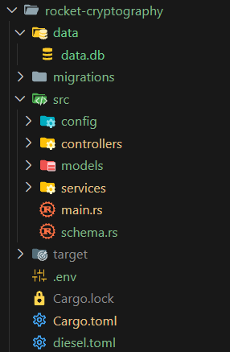

# Ending

## Final file structure

## Ideas for further app development
- AES, RSA: Generate keys once and save them to database. Then while encrypting and decrypting retrieve them from db.
- SHA: Add saving to the database how many times a user managed to draw a hash with X leading zeros.

## Resources for further learning
- https://rocket.rs/guide/v0.5/
- https://www.youtube.com/watch?v=5C_HPTJg5ek
- https://doc.rust-lang.org/book/
